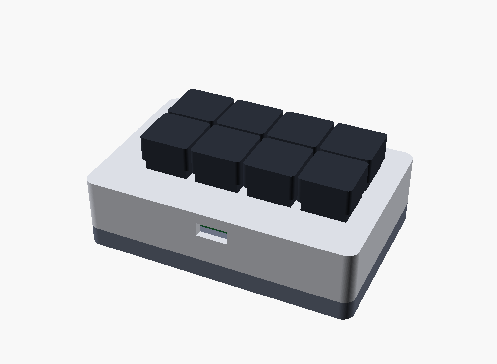
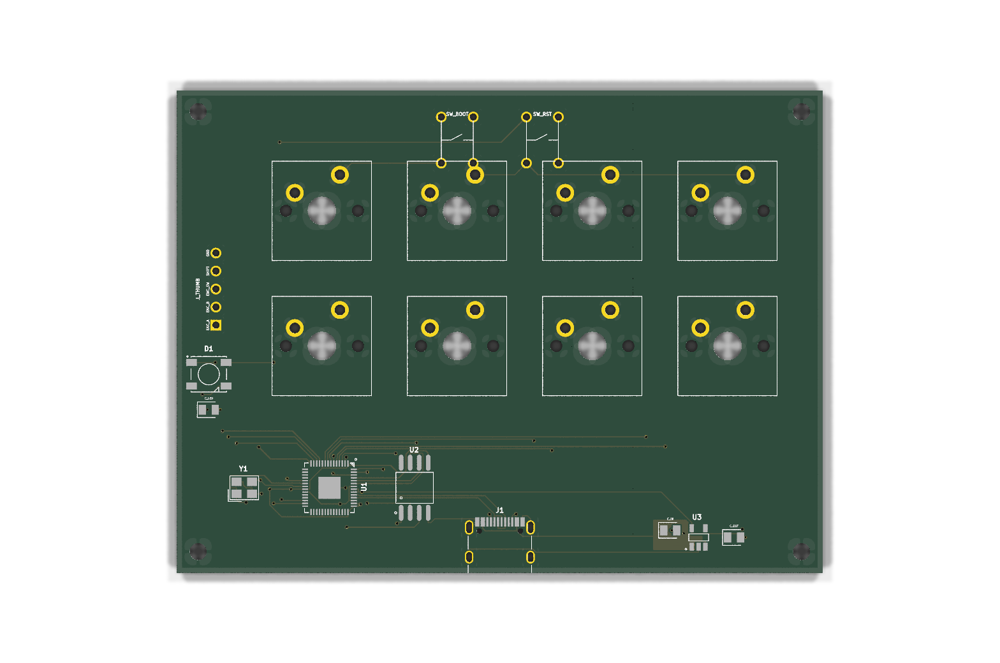
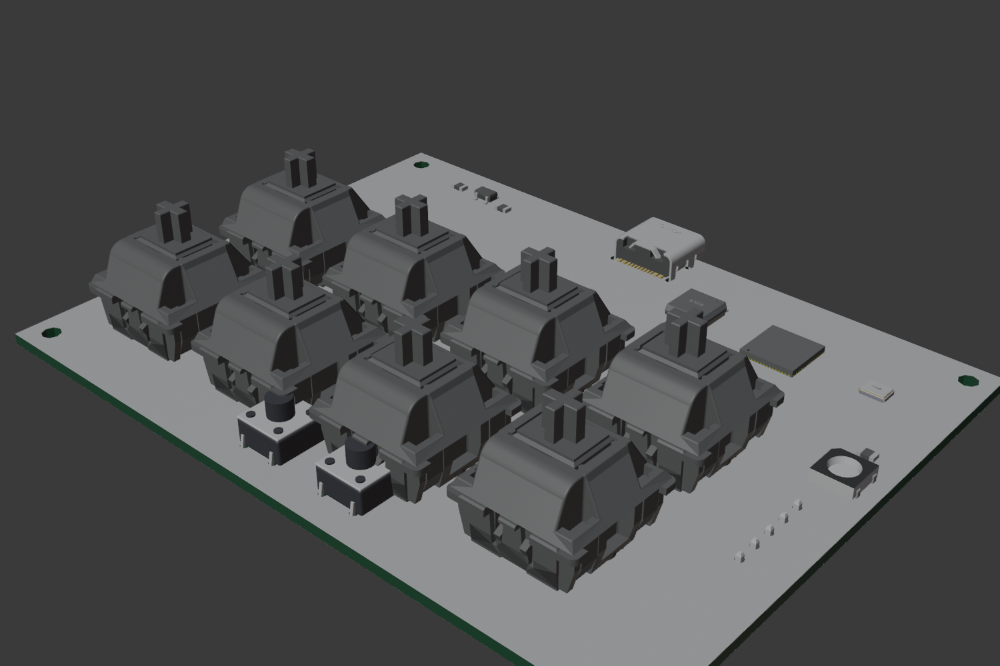

# einhander

A one-handed hardware controller for music performance and sequencing — MC-303-inspired,
simplicity-first. Two rows of four key switches under the fingers, a thumbwheel + SHIFT on
the side for the thumb, so the other hand stays free for sliders/faders.

This repo holds the **code-driven** design: a parametric enclosure (build123d) and a
fabbable PCB (tscircuit → KiCad).



## What's here

```
cad/    parametric enclosure — build123d (machine_params.py = single source of truth),
        top/bottom shells + component stand-ins, assembly + dated render log
pcb/    RP2040 USB-MIDI controller board
          index.circuit.tsx        composes the board (flat, global nets)
          modules/                 mcu (RP2040+flash+xtal+decoupling), power (USB-C+LDO)
          lib/, imports/           shared params, custom Cherry-MX footprint, JLC parts
          scripts/                 route4.sh + the 4-layer routing toolchain
          index.circuit.kicad_pcb  routed 4-layer board
          fab/                     Gerbers + drill + CPL  (einhander-gerbers.zip → upload to JLCPCB)
```

## The board

- **RP2040**, pure **USB-MIDI** controller (class-compliant, no drivers), wired USB-C
- 8 MX key switches on direct GPIO; EC11 thumbwheel + SHIFT broken out to a header for a
  left-wall daughterboard; one WS2812 status LED; BOOTSEL/RESET
- **4-layer**: signals on outer layers, dedicated **GND + 3V3 inner planes**
- **DRC-clean**, ~91 × 68 mm





Interactive 3D model of the populated board: **`pcb/renders/einhander-pcba.glb`** (open in any glTF viewer — Blender, VS Code glTF, or https://gltf-viewer.donmccurdy.com).

### Fabricating it

Upload `pcb/fab/einhander-gerbers.zip` to [JLCPCB](https://jlcpcb.com) (select **4 layers**). For
assembly, add `pcb/fab/einhander-bom.csv` (27 SMD parts, LCSC-mapped) + `pcb/fab/einhander-cpl.csv`
(placement). MX switches, the EC11 thumbwheel, headers, and BOOT/RESET tactiles are **hand-soldered**
(listed separately in `einhander-handsolder.csv`, kept out of the assembly BOM).

**PCBWay** uses the same `einhander-gerbers.zip` + `einhander-cpl.csv`, with `einhander-bom-pcbway.csv`
(sources by manufacturer part number instead of LCSC). `make_fab.sh` emits both BOM formats. Regenerate the whole bundle with `bash pcb/scripts/make_fab.sh pcb/index.circuit.kicad_pcb einhander`.

### Regenerating

```bash
# enclosure
cd cad && python3 machine.py            # STLs + renders

# PCB (needs bun/tscircuit, KiCad 9, Freerouting v2.2.4 + JDK 25)
cd pcb && npm install
bash scripts/route4.sh                  # export → route (4-layer) → inject → DRC
```

## Status

Enclosure prototype ✅ · Routed 4-layer PCB ✅ (fab-ready) · thumb-cluster daughterboard, RP2040
firmware (TinyUSB MIDI), and an enclosure↔board fit re-sync are next.

---
Designed with [Claude Code](https://claude.com/claude-code).
